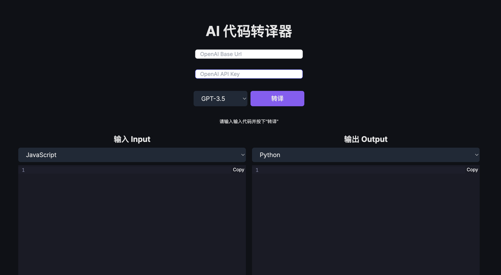

# AI代码翻译器

使用人工智能将代码从一种语言翻译成另一种语言。



## 本地运行

**1. 克隆仓库**

```bash
git clone https://github.com/wmh1024/ai-code-translator.git
```

**2. 安装依赖**

```bash
npm i
```

**3. 运行应用**

```bash
npm run dev
```
